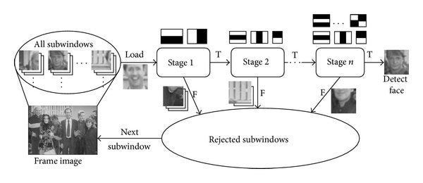
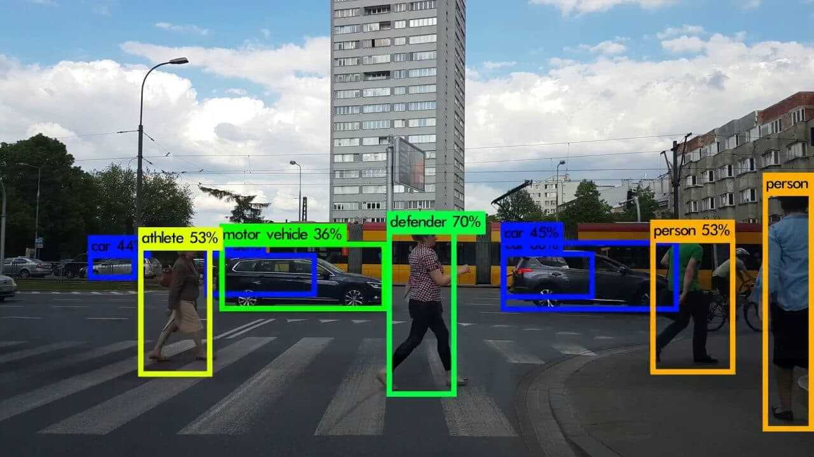

># *"yolov8-eyleyenzi"* repo'suna hoşgeldiniz !
Bu repo'da *yolov8(ultralytics) , opencv-python* _vb._ envai çeşit python modülüyle <mark>*görüntü işleme*</mark> eyleyeceğiz. 

> ## Ney nedir ? (Olabildiğince az teknik terim kullanarak...) 
+ ### OpenCV (Open Source Computer Vision) (Açık Kaynaklı Görüntü İşleme kütüphanesi) *ne olaki*?

İntel'in geliştirmeye başladığı ve daha sonra Nvidia vb. diğer şirketlerinde dahil olduğu, kökenleri ta 1999'lara dayanan bir <mark>açık kaynaklı bir görüntü işleme programıdır</mark>. Öncelikle C/C++ için geliştirilmiş olsada ilerleyen dönemlerde Python'un popülerleşmesiyle (öğrenmesi ve kullanması daha kolay olduğu için ..bence) sonrasında Python, Java vb. dillere de aktarılmıştır.    Bünyesinde yüzlerce görüntü işleme algoritması içeren bu kütüphane <mark>*yüz tanıma, nesne ayırt etme/sınıflandırma, hareket tespiti vb.*</mark> birçok kritik görüntü işleme fonksiyonlarını yerine getirebilmekle beraber <mark>*görsel açma, üzerine şekil çizme, görsel kaydetme, video oynatma, kameradan görüntü aktarma*</mark> gibi temel görsel fonksiyonlarıda içerir, <mark>kısaca bir bilgisayarla görsel işlemel için gerekebilecek neredeyse bütün fonksiyonaliteleri kapsar</mark>.  

Obje tespit etme işlemi ise görüntünün *gri formata(grayscale)* çevrilmesi(sonuçta renklerle bir işimiz yok ve bu formatta pixeller daha az yer kaplar/daha kolay işlenir) ,sonrasında bu formatta *ani renk değişimi gerçekleşen kısımların objelerin kenarları olarak varsayılması ve işaretlenmesi* aracılığıyla bir *"kenar haritası"(edge map)* çıkartılması ,sonrasında halihazırda var olan <mark>*tespit etmek istediğimiz objenin kenar haritası kalıp alınarak görselin daha ufak görsellere ayrılıp bu görsellerdeki kenarlarla kalıp aldığımız kenar haritasının karşılaştırılması aracılığıyla nesnelerin bulunduğu dikdörtgensel alanın tespit edilmesi*</mark> şeklinde gerçekleşir İDİ.  

Ancak görüntü işlemedeki diğer gelişmelerle çok daha keskin, hızlı ve verimli nesne tespiti ve görüntü işleme teknikleri ortaya çıktı.Mesela "Haar Cascade" tekniği: (bu noktadan sonra top Prof. Dr. ChatGPT'de)  

..."Haar Cascade tekniğinde ise nesne tespit etme işlemi benzer şekilde; görüntünün genellikle gri formata (grayscale) dönüştürülmesiyle başlar (model renk bilgisine ihtiyaç duymaz). Sonrasında insan eliyle belirlenmiş ve eğitim sırasında kullanılan basit dikdörtgensel özellik filtreleri (_"Haar" benzeri özellikler_) görüntü üzerinde farklı boyut ve konumlarda taranır. Bu filtreler, görüntüdeki açık-koyu geçişlerini sayısal olarak analiz ederek belirli bir objeye ait olabilecek yapısal desenleri ararlar. Tarama yapılan her bölge için hızlı hesaplama amacıyla _"integral image"_ yöntemi kullanılır ve bu bölge kademeli olarak birden fazla sınıflandırma aşamasından oluşan _‘cascade’_ yapı üzerinden geçirilir. Eğer bölge tüm aşamalardan başarıyla geçerse ilgili nesnenin bulunduğu dikdörtgensel alan olarak işaretlenerek nesne tespiti gerçekleştirilmiş olur. "...   

<mark>Yani kısaca sadece bir objenin kenarları değil, obje üzerindeki belirgin kısımlar da işaretlenerek objelerin tespit edilmesi daha keskin bir hale gelir (örn:yüz tespiti için burun ,göz ,ağızın da kontrol edilmesi)</mark>. 
Ancak bu iki yöntemin de <mark>en büyük dezavantajlarından birisi *gerçek zamanlı olarak obje tespiti*dir, çünkü bu algoritmalar bir görseli *binbir parçaya ayırıp o parçaları teker teker elimizdeki filtrelere göre mukayese ederiz* ve bu biraz *zaman alan bir işlemdir*</mark>.  
..Ve işte işin bu kısmında YOLO  _(from Ultralytics)_  kütüphanesinin görüntü işleme mekanizmaları işin içine giriyor.

+ ### _Peki..._ YOLO(You Only Look Once)("Tek Bakışta" _fln demek heralde.._) ve Yolov8 *ne iş*?

Buraya kadar anlattıklarıma ufak bi göz gezdirdiğinizi ve OpenCV kütüphanesinin ne işe yaradığını ve bizi niçin ilgilendirdiğini anladığınızı varsayıyorum. YOLO kütüphanesi de bir görseldeki objelerin ayırt edilmesi, sınıflandırılması vb. işlemler için kullanılır ancak OpenCV gibi değilde daha çok obje tespiti/sınıflandırılması alanında *özelleşmiş* bir kütüphane diyebiliriz. YOLO kütüphanesinin obje tespit mekanizmasını OpenCV'den farklı kılan ise <mark> *işleyeceği görselleri daha küçük görsellere ayırmadan, görseli direkt bir ızgaraya(grid) ayırarak ızgaranın bölümlerini (tek etapta) elimizde var olan ,belirli obje sınıfları(vazo/insan/araba/vb.) ile eğitilmiş nöral ağlar aracılığıyla karşılaştırarak(inference) ve bu karşılaştırma sonucu ızgaranın bazı bölgelerine belirli bir sınıfa ait olabileceğine ait bir "kesinlik"(confidence) değeri atayarak sonrasında bu kesinlik değer(ler)inin belirili bir eşiğin üstünde olması ve aynı bölgeye ait diğer sınıfların kesinlik değerlerinden yüksek olmasına göre o bölgeye bir sınıf/obje tipi ataması(labeling)* şeklinde gerçekleşir.</mark>  
Bu sayede hem zamandan önemli ölçüde tasarruf sağlar hem de objelerin üst üste örtüşmeleri daha mantıklı bir şekilde işlenerek daha "doğru" bir sonuç verir .  
VE tabikide OpenCV gibi YOLO'da zaman ilerledikçe kuruluşundan itibaren gerek resmi gerek topluluğu(community) tarafından(YOLO'da açık kaynaklıdır.) önemli güncellemeler alarak performansı, fonksiyonalitesi vb. geliştirileren bir kütüphanedir. Ancak <mark>YOLO, OpenCV'ye göre daha az kurumsal/merkezi bir kütüphane olması sebebiyle, versiyonları OpenCV'den farklı olarak ana kaynağın üstüne inşa edilmektense v5, v6, v8, NAS  _(from Super-Gradients)_ , v11 gibi versiyonlara ayrılarak geliştirilmektedir.<mark>  

## Çıktı Örneği:

>... SONUÇ: Artık bu repo'da OpenCV-Python ve Ultralytics-YOLO kütüphanelerini kullanacağımı, sizin ne kasteddiğimi anladığınızı varsayarak rahatlıkla belirtebilirm.!

># YOLO Model Kullanımı / Eğitimi

Yazılımsal olarak nasıl kullanacağımızı <mark> *projelerde* </mark> bulabilirsiniz, burada daha çok sözel ibarelerle mantığını anlatmaya çalışacağım.

+ ### Hangi YOLO?

Bahsettiğim üzere gerek resmi gerek gayriresmi birçok YOLO versiyonu mevcut. Daha güncel YOLO versiyonları mevcut olmakla birlikte hem resmi bir versiyon olması hem de daha hafif olması sebebiyle şimdilik *YOLO V8* versiyonunun modellerini tercih edeceğim. Şimdi bu modeli amacımıza riayeten nasıl eğitebileceğimizi öğrenelim. Bu projede hazır obje veri setleri(datasets) yerine kendi veri setimizi oluşturacağız ve bunun için Label Studio'yu kullanacağız.

+ ### Model eğitimi..? Label Studio..??

Daha önce bahsettiğim üzere YOLO kütüphanesi görsellerdeki belirli objeleri tespit etmek ve sınıflandırmak için belirli bir obje sınıfı/sınıfları üzere "eğitilmiş" sanal nöron ağlarını kullanır (Nöron ağından kasıt bilgisayarın farklı görsellere adapte olabilecek şekilde belirli kalıpları matematiksel olarak saklaması~ denebilir. Aynı hafızamızın nöronların bazı elektriksel sinyalleri saklamasıyla belirli kalıpları ayırt edebilmemizi sağlaması gibi...). Mevzubahis nöron ağlarının eğitimi ise pratik olarak aslında gayet basit ancak zaman alan bir süreç. Öncelikle; nasıl bir çocuğa hangi objenin isminin ne olduğunun öğretilmesi gibi önce kendimiz elle o objeyi gösterip ismini çocuğumuza öğretmeye çalışacağız; yani baz aldığımız YOLO modeline(nöral ağ seti~) objeleri öncelikle kendimiz, elimizle(ve Label Studio aracılığıyla) bir görseldeki objelerin bulunduğu dikdörtgensel alanları belirleyerek ve o bölgedeki objenin sınıfını belirterek bir veri seti oluşturacağız.  

*Sonuç olarak* bu bahsettiğimiz veri seti dosyası genel olarak belirli sayıda görsellerden, ve o görsellerdeki objelerin koordinatları(x,y,w,h) ile sınıflarını(kedi/köpek/vazo...) belirten bir dizi .txt dosyasından oluşacak.

+ ### Dataset hazır, peki ya şimdi ?

Sonraki adım olarak bu dataset'i kullanarak seçtiğimiz YOLO modelini "eğiteceğiz"(training). <mark> Bu süreci anlatan Google Colab dosyama [*buradan*]() ulaşabilirsiniz. </mark>

